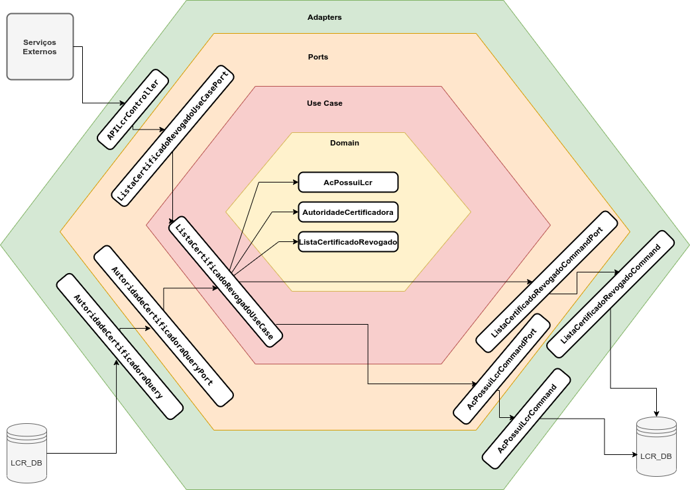

# 💻 Microservice para inclusão de LCR usando Arquitetura Hexagonal
__________________________________________________________________________________________

Esta API permite a inclusão de uma LCR (Lista de certificado Revogado) para uma AC (Autoridade Certificadora), caso
ela não exista ainda.

## Arquitetura Hexagonal
______________



### ⚙️ Descrição do serviço

- **Serviço:** api-lcr-rsocket
- **Função:** Esta API permite incluir uma URL na lista de certificado revogado de uma AC.
- **Protocolo:** RSocket com fluxo do tipo **Request-Response**.
- **Método:** api-lcr.incluir
- **Parâmetro da Mensagem :**
    - **Entrada :**
        - **RequisicaoDTO:** 
            - **nomeAC:** Nome da autoridade certificadora
            - **urlLcr:** URL da lista de certificado revogado
            - **indiLcrDelta:** Status da LCR (0 - Ativo, 1 - Desativado)
            - **indiAtualzLcr:** Controla a atualização da LCR (S=sim, N=não)
    - **Retorno :**
        - **RespostaDTO:**
            - **cStatus:** Código do Status do motivo
            - **xMotivo:** Descrição do Motivo

## 🛠 Tecnologias utilizadas
_________________________

As seguintes ferramentas foram utilizadas na construção desta API:

    * JDK 11
    * Maven
    * Lombok
    * Spring WebFlux
    * Spring R2BC
    * Mssql JDBC Driver
    * Docker

## 🚀 Executando a aplicação

1. Execute os serviços Docker:

    ```docker-compose up -d```

2. Criar o banco de dados 

    ```docker exec -it api-lcr-rsocket_db_1 /opt/mssql-tools/bin/sqlcmd -S localhost -U sa -P <senha> -d lcr_db -i ./database.sql```

3. Execute a aplicação: 

    ```./mvnw spring-boot:run```

## Envidando uma requisição via cliente rsocket (rsc)

```java -jar rsc-0.6.1.jar --request --route=api-lcr.incluir --debug tcp://localhost:7000 -d '{"nomeAC":"AC SOLUTI Multipla v5","urlLcr":"http://ccd.acsoluti.com.br/lcr/ac-soluti-multipla-v5.crl","indiLcrDelta":0,"indiAtualzLcr":"S"}'```
