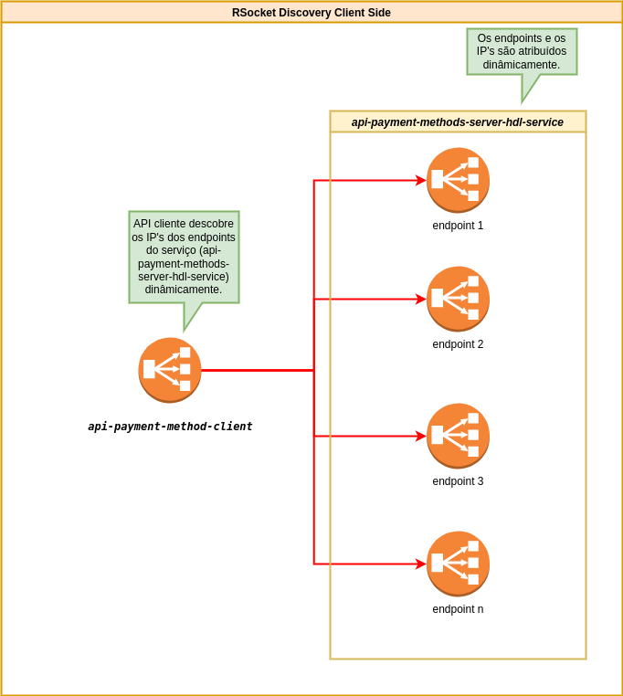

# Getting Started

In modern cloud-based microservices applications, communication between microservices has some challenges, one of which is service discovery.
In this type of application, the network locations of service instances are dynamically defined, and changes are also made dynamically due to autoscaling, or failures and updates.
As a result, the client of these services needs a more elaborate service discovery mechanism.
There are two service discovery patterns: client-side and server-side.
The idea in this example is to implement client-side service discovery for API's that use the rsocket protocol, for that we are going to implement a REST API as a client of an rsocket API.
For this purpose we will use spring boot, the two APIs should work in a CaaS environment based on kubernetes and Docker swarm.
The idea is that the Rest API client can discover at runtime and dynamically the instances of the Rsocket API that are healthy and ready to use. If there is a scaling of the number of Rsocket API instances, the Rest API client must update its list of rsockets endpoint instances.
There are several ways to implement this, but here I'm going to use the DNS-based, dynamic discovery approach offered by the orchestration environments: Kubernetes and Docker Swarm.

## modules:

**- rsocket-csd-core:** Este módulo possue a implementação do método de descoberta do lado cliente, e outras classes utilitárias necessárias para o processo.

**- api-payment-methods-client:** API Rest com webflux que fará o papel de client rsocket, aonde será implementado a Descoberta do Serviço do Lado Cliente.

**- api-payment-methods-server:** API Rsocket ao qual o cliente acessará através do método de descoberta de serviço do lado cliente.

## Arquitetura

